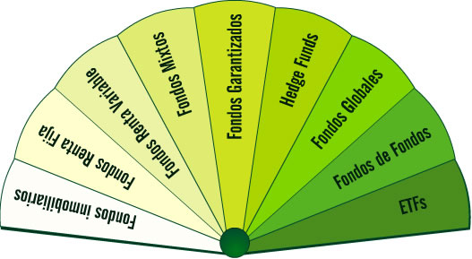

# Introducción a los Fondos de Inversión

Un **fondo de inversión** es un patrimonio formado por las aportaciones de un número variable de ahorradores (denominados _partícipes_).

Una entidad (denominada _gestora_) invierte de forma conjunta estas aportaciones en diferentes activos financieros (renta fija, renta variable, derivados o cualquier combinación de estos) siguiendo unas pautas fijadas de antemano.

Cada inversor (partícipe) es propietario de una parte del patrimonio del fondo en proporción al valor de sus aportaciones. El resultado de la inversión (aumentos o disminuciones del valor del patrimonio) se atribuye proporcionalmente a los partícipes.

## Fondos de Inversión en España

Los fondos de inversión iniciaron su andadura en España durante la década de los 80. Desde entonces, se han configurado como uno de los productos preferidos por los inversores españoles. A pesar de las fluctuaciones de los mercados y de las sucesivas reformas fiscales, los fondos han mantenido su atractivo como destino preferente del ahorro familiar, hasta constituir un mercado maduro y preparado para afrontar nuevos retos.

## Ventajas de los Fondos de Inversión

Los fondos de inversión ofrecen numerosas ventajas al pequeño inversor:

### Ventaja: Acceso a prácticamente cualquier mercado

El inversor, a través de los diferentes tipos de fondos, tiene acceso a mercados que en muchos casos no estarían a su alcance si invirtiese de forma individual.

Esta característica le ayuda a diversificar sus inversiones. Diversificar es un concepto básico al invertir. Significa repartir el dinero en diferentes productos con distintos comportamientos, de manera que si alguno/s de ellos genera pérdidas éstas se compensen, al menos en parte, con las ganancias de otro/s.

Como suele decirse, se trata de “no poner todos los huevos en la misma cesta”.

### Ventaja: Gestión profesional

Quien invierte en fondos está confiando una parte de sus ahorros a un profesional (la gestora del fondo). Este profesional dedica todo su tiempo a analizar el comportamiento de los mercados y, en general, la situación económica. Utilizando esta información y teniendo en cuenta el objetivo del fondo, la entidad gestora tratará de rentabilizar las aportaciones de los inversores.

A cambio de contar con una gestión profesional de sus ahorros el inversor paga una comisión a la gestora. Esta comisión debe encontrarse dentro de los límites máximos fijados por la ley, varía de un fondo a otro y, al igual que el resto de comisiones, se encuentra recogida en el folleto informativo de cada fondo.

### Ventaja: Eficiencia

Al invertir de forma colectiva, los fondos de inversión aprovechan las economías de escala. Es decir, incurren en menores costes al operar en los mercados

## Un amplio abanico de posibilidades

Actualmente existe una tipología de fondos extraordinariamente variada que permite encontrar productos adecuados para cualquier perfil inversor, desde los más conservadores a los más dispuestos a asumir riesgos. Sin embargo, esta gran diversidad también puede dificultar al inversor la elección del fondo

## La CNMV

En el marco de su compromiso con la protección y formación de los inversores, la **Comisión Nacional del Mercado de Valores** trata de aclarar todos aquellos aspectos de los fondos de inversión que plantean dudas. Este es el objetivo de este tutorial y de las publicaciones que sobre esta materia desarrolla la CNMV.

Los fondos de inversión constituyen una herramienta privilegiada para que los particulares se familiaricen con el complejo pero atractivo mundo de los mercados de valores.

