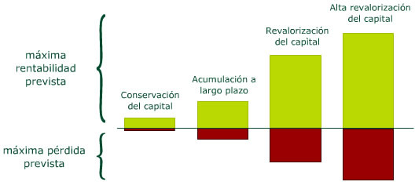
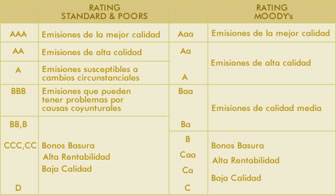

# ¿Tienen riesgo los fondos de inversión?

Como cualquier otro producto de inversión los fondos implican asumir un determinado nivel de riesgo. Cada fondo, en función de sus características específicas y de los activos en los que invierta implicará más o menos riesgo.

La elección entre los distintos tipos de fondos debe hacerse teniendo en cuenta la capacidad y el deseo del ahorrador de asumir riesgo, así como su horizonte temporal, es decir el plazo en que estima que necesitará recuperar su dinero.

**Si la evolución de los mercados o de los activos en los que invierte no es la esperada, el fondo puede tener pérdidas.** Por eso el inversor, al elegir un fondo, debe analizar el riesgo que conlleva, y decidir hasta qué punto está dispuesto a asumir que, al solicitar el reembolso, su inversión valga menos que en el momento de la compra.

## Conceptos relacionados con el riesgo de fondo de inversión

### Volatilidad

La volatilidad nos indica si históricamente los valores liquidativos del fondo han experimentado variaciones importantes o si, por el contrario, han evolucionado de manera estable. Un fondo muy volátil tiene más riesgo porque es difícil prever si el valor liquidativo va a subir o a bajar. Por tanto, en el momento del reembolso, lo mismo podrían obtenerse ganancias significativas que pérdidas importantes.

Si el inversor adopta la volatilidad como criterio de decisión, debe tener en cuenta que existen distintas formas de cálculo y presentación (diaria, mensual, anualizada...). Por eso es aconsejable seleccionar una fuente de confianza y ceñirse a la misma, ya que los datos de distintas fuentes pueden no ser del todo comparables


### Duración ⁉️⁉️

La duración (o plazo medio de vencimiento) es un concepto que permite estimar cómo responderán los activos de renta fija (por ejemplo, bonos y obligaciones) ante las variaciones de los tipos de interés. Cuando los tipos de interés suben el precio de los valores de renta fija disminuye para poder igualar la mayor rentabilidad que ofrecen las nuevas emisiones. En caso de una bajada de tipos el resultado es el contrario. 

Este efecto es menor cuanto menor es el plazo de vencimiento (duración) de los valores de renta fija.

Por ello, a menor duración de la cartera de renta fija del fondo, menor sensibilidad a los movimientos de los tipos de interés y por tanto menor riesgo (menor oscilación de su valor)


---

Antes de suscribir participaciones de un determinado fondo, el inversor debe consultar en su folleto informativo su política de inversión o vocación (renta fija, renta variable, mixto, garantizado…). Se trata de conocer en qué tipo de activos invierte o qué estrategias utiliza. Además, si el fondo tiene cierta antigüedad, mediante el último informe trimestral deberá consultar la composición de su cartera.

Estos documentos pueden solicitarse a la entidad comercializadora y pueden consultarse a través de su página web o en la de la CNMV

**Ejemplos de políticas de inversión y rentabilidades / riesgo esperados**



Cuatro gráficas de barras que representan cuatro políticas de inversión. Cada una tiene una parte positiva, por encima del eje X que corresponde a la máxima rentabilidad prevista, y una parte negativa, por debajo del eje X que corresponde a la máxima pérdida prevista.

- La primera política de inversión es **conservación del capital**; tiene baja rentabilidad prevista y muy bajas pérdidas previstas.
- La segunda política de inversión, **acumulación de capital a largo plazo**, tiene más o menos el doble de rentabilidad prevista y el doble de máxima pérdida prevista.
- La tercera política de inversión, **revalorización del capital** tiene una máxima rentabilidad prevista media alta, pero con una máxima pérdida prevista también media alta.
- Por último, la barra correspondiente a la política de inversión de **alta revalorización del capital** tiene muy altas tanto la máxima rentabilidad prevista como la máxima pérdida prevista.

## Factores que influyen en el nivel de riesgo de un fondo

Conocer la composición de la cartera y la vocación inversora del fondo es fundamental ya que permite al inversor hacerse una idea del riesgo que el fondo asume. 

Con carácter general pueden hacerse las siguientes afirmaciones:


### Tipos de Activos

La inversión en renta variable tiene, en general, más riesgo que la inversión en renta fija, ya que las cotizaciones de las acciones son más volátiles. Sin embargo, el inversor tiene que ser consciente de que la renta fija también puede generar pérdidas, ya que su valor también fluctúa (como hemos visto al hablar de la duración, las variaciones de los tipos de interés afectan al precio de la renta fija).  

```
Renta Fija vs Renta Variable
```

### Calidad de crédito

Algunos fondos, por su política de inversión, pueden mantener en cartera valores que incorporen un mayor riesgo de crédito o contraparte: es la posibilidad de que el emisor (empresa, entidad financiera o Estado, entre otros) no pueda hacer frente a sus pagos o de que se produzca un retraso en los mismos. En estos casos podría ser interesante conocer la calidad de crédito de los emisores, a través de la calificación que realizan entidades especializadas (agencias de rating).



### País o Zona

La inversión en valores de países emergentes conlleva otro riesgo adicional, el llamado riesgo país, que recoge la posibilidad de que los acontecimientos políticos, económicos y sociales de ese país afecten a las inversiones que en él se mantienen.

### Divisa

La inversión en activos expresados en monedas distintas del euro implica un riesgo, denominado riesgo de divisa, derivado de las posibles fluctuaciones de los tipos de cambio

### Derivados

Los fondos que invierten en instrumentos financieros derivados (futuros, opciones, etc.) pueden incorporar un riesgo superior debido a las características intrínsecas de estos productos (por ejemplo, el apalancamiento). Por tanto, es posible que se multipliquen las pérdidas de la cartera, aunque también podrían multiplicarse las ganancias. Sin embargo, hay que tener en cuenta que algunos fondos utilizan los derivados exclusiva o primordialmente con la finalidad de disminuir los riesgos de la cartera de contado (cobertura); en la descripción de la política de inversión, que se recoge en el folleto, se indica si los derivados se utilizarán con finalidad de inversión o de cobertura.

> En términos generales, el **apalancamiento** se refiere al efecto que el endeudamiento, es decir, invertir con dinero prestado, tiene sobre la rentabilidad. En los mercados de valores, hace referencia al hecho de que con pequeñas cantidades de dinero puede realizarse una inversión que se comporta como otra de un volumen muy superior. Por ejemplo, es lo que ocurre al adquirir opciones o warrants: pagando una pequeña cantidad (la prima), el inversor tiene la posibilidad de obtener el mismo resultado que si hubiera comprado o vendido valores cuyo valor de mercado es muy superior. Mientras llega el vencimiento de la opción, el inversor puede obtener rentabilidad del dinero que aún no ha tenido que desembolsar para la adquisición de los valores. Así, una inversión en warrants puede ser mucho más rentable que la misma inversión en el subyacente, si los mercados evolucionan favorablemente a su posición; pero a cambio aumenta el riesgo, y la posibilidad de perder toda la inversión si la evolución no es la esperada.