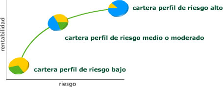

# Criterios para elegir un fondo de inversión

Cada fondo tiene sus propias características e implica diferentes niveles de riesgo.

Al elegir un fondo, el inversor debe analizar con detalle esas características y riesgos,  para determinar cual es el más adecuado de acuerdo con sus necesidades y preferencias.

Deben realizarse dos tipos de análisis:

- **Determinación de la situación y objetivos personales.**

    Es necesario tener claros aspectos como el riesgo de pérdidas que se está dispuesto a asumir y el plazo durante el cual se desea mantener la inversión.
    La respuesta a estas cuestiones permitirá acotar el tipo de fondo que mejor se adapta a los objetivos personales de inversión.

- **Selección del fondo.**

    Para elegir un fondo de inversión concreto, dentro de la amplia gama disponible en nuestro país, hace falta conocer una serie de aspectos básicos que se detallan en su folleto informativo. La consulta de este documento, cuya entrega es obligatoria antes de la suscripción, es imprescindible para tomar una decisión informada.


Al elegir un fondo de inversión deben tenerse en cuenta los siguientes aspectos:

- Perfil de riesgo y política de inversión
- Horizonte temporal recomendado
- Comisiones
- Rentabilidades históricas
- Publicidad y mensajes comerciales

A continuación analizaremos cada uno de ellos.

## Perfil de riesgo y política de inversión

El **perfil de riesgo** (por motivos didácticos se simplifica el concepto de perfil de riesgo, que de manera estricta se encuentra determinado por otros muchos factores) indica _la capacidad del inversor de asumir pérdidas_. Existe una estrecha relación entre rentabilidad y riesgo. Para tener la posibilidad de obtener una mayor rentabilidad es necesario asumir un mayor riesgo.

El inversor debería suscribir aquellos fondos con un nivel de riesgo acorde a su propio perfil de riesgo (bajo, medio, alto). El perfil de riesgo del fondo se especifica en su folleto informativo (en el capítulo 3 hemos visto como el riesgo de un fondo se encuentra estrechamente ligado a su política de inversión).

Si un inversor no tiene claro cuál es el perfil de riesgo que le corresponde puede solicitar asesoramiento a su entidad financiera. Los intermediarios suelen contar con cuestionarios para determinar el perfil de riesgo de sus clientes, tanto en sus oficinas como a través de Internet.

El perfil de riesgo indica la capacidad del inversor de asumir pérdidas. Existe una estrecha relación entre rentabilidad y riesgo. Para tener la posibilidad de obtener una mayor rentabilidad es necesario asumir un mayor riesgo.



Esta gráfica representa ejemplos de composiciones de carteras. El eje X representa el _nivel de riesgo de las inversiones_ y el eje Y representa la _rentabilidad potencial prevista_. La primera cartera se sitúa en la zona de bajo riesgo y baja rentabilidad (abajo y a la izquierda) y corresponde a un inversor con perfil de riesgo bajo. La segunda cartera está hacia el medio de los dos ejes y corresponde a un inversor con perfil de riesgo medio o moderado. La tercera cartera, arriba y a la derecha corresponde a un inversor con perfil de riesgo alto.

Por motivos didácticos se muestran ejemplos simplificados de posibles composiciones de carteras. Ver siempre el folleto del fondo para conocer la política inversora real.

### Perfil de riesgo bajo

Corresponde en general a una política de inversión que tiene como objetivo la preservación del capital.

Los inversores con perfil de riesgo bajo tienen poca tolerancia a las pérdidas, y están dispuestos a obtener menores rentabilidades a cambio de asegurar la preservación del capital. Con este enfoque, en general, resultarían más aconsejables algunos tipos de fondos de renta fija o fondos monetarios


```
Amarillo → Renta Fija (+/- 70%) 
Verde → Activos Monetarios (30%)
```


- **Perfil de riesgo** → Bajo
- **Objetivo del fondo** → Preservación del capital


### Perfil de riesgo medio o moderado

Los inversores con **perfil de riesgo medio** o moderado están dispuestos a asumir determinados niveles de pérdidas, a cambio de la posibilidad de obtener cierta rentabilidad. A grandes rasgos, podrían resultar indicados los fondos mixtos (renta fija y variable).


```
Amarillo → Renta Fija (+/- 35%)
Azul → Renta Variable (45%)
Verde → Activos Monetarios (20%)

```

- **Perfil de riesgo** → Moderado
- **Objetivo del fondo** → Revalorización moderada del capital

### Perfil de riesgo alto

Los inversores con perfil de riesgo alto tienen poca aversión al riesgo. Sus expectativas de rentabilidad son elevadas y están dispuestos a aceptar fuertes pérdidas de capital. Pueden invertir en todo tipo de fondos, incluyendo aquéllos que, a priori, incorporan mayores niveles de riesgo.

Fondos de renta variable de determinados sectores o países (tecnológicos, mercados emergentes...), fondos de inversión libre, etc.


```
Amarillo → Renta Fija (+/- 20%)
Azul → Renta Variable (80%)
(sectorial, global, otros) 
```


- **Perfil de riesgo** → Alto
- **Objetivo del fondo** → Alta revalorización del capital

## Horizonte temporal recomendado

En función de la política de inversión del fondo será aconsejable estar dispuestos a mantener la inversión durante un determinado período de tiempo. El folleto informativo indica cual es el horizonte recomendado para cada fondo concreto en función de sus características: naturaleza de las inversiones realizadas, mercados en los que invierte, garantía…

> Ejemplo → Por ejemplo, los fondos más volátiles exigirán horizontes superiores, ya que de esta forma el inversor dispondrá de margen para recuperarse de las fases negativas de los mercados.

Si el inversor no puede permanecer en el fondo durante el período de tiempo recomendado es posible que la rentabilidad se vea perjudicada por:

- **Rentabilidades Negativas**

    Como consecuencia de los vaivenes del mercado: Aunque, salvo en los fondos garantizados, mantener la inversión durante el horizonte recomendado no asegura nada, los tipos de activos en los que invierte cada fondo aconsejan mantener la inversión durante un determinado período de tiempo mínimo. Por ejemplo, el horizonte temporal de un fondo de renta variable podría ser entre tres y cinco años, con el fin de que, en ese plazo, se puedan superar las caídas de los mercados que se produzcan a corto plazo. 

- **Comisiones de reembolso**

    Algunos fondos establecen comisiones de reembolso en función del tiempo de permanencia: a medida que transcurre el tiempo la comisión se reduce o incluso desaparece, favoreciendo así a los inversores estables.

- **Vencimiento de la garantía**

    En los garantizados se aconseja mantener la inversión hasta el vencimiento de la garantía. Si se reembolsa antes de esa fecha, además de afrontar la habitual comisión de reembolso es posible perder parte del capital invertido (si el valor liquidativo en ese momento es inferior al inicial).


En consecuencia, la cantidad que se invierta en un fondo debe poder mantenerse durante su horizonte temporal recomendado.  Esto exige de cada inversor una planificación previa de sus finanzas personales según sus perspectivas de ingresos y gastos, gastos extraordinarios previstos, cantidad reservada para compromisos inesperados...

> El inversor debe prever cuándo va a necesitar disponer del dinero invertido y elegir un fondo con un horizonte temporal adecuado.


## Comisiones

Las comisiones que cargan los fondos de inversión son otro elemento que deben tener en cuenta los inversores a la hora de elegir, ya que pueden tener una incidencia significativa sobre la rentabilidad. Su cuantía y condiciones de aplicación se detallan de forma exhaustiva en el folleto.

También se deben recoger en el folleto los gastos adicionales que deban soportar los fondos de inversión debido a servicios prestados que resulten imprescindibles, y no relacionados con las actividades de gestión y depositaria.

Hay distintos tipos de comisiones:

- Comisiones de gestión y depósito
- Comisiones de suscripción y reembolso

### Comisiones de gestión y depósito

Son las que cobran la gestora y el depositario, respectivamente. Estas comisiones son implícitas, es decir, ya están deducidas del valor liquidativo del fondo que se publica (se cargan directamente al fondo).

Existe una excepción al carácter implícito de la comisión de gestión: si el fondo carga comisiones sobre resultados y se opta por un sistema de cargo individual, cada partícipe pagará comisión en función del resultado de su inversión en el fondo.

La **comisión de gestión** puede establecerse en función del patrimonio, de los rendimientos o de ambas variables, existiendo límites máximos. Debe consultarse en el folleto la posibilidad de que se apliquen distintas comisiones en función de la permanencia, etc.

**La de depósito** es la que cobran los depositarios por la administración y custodia de los valores. _No podrá superar el 2 por mil anual del patrimonio._


### Comisiones de suscripción y reembolso

Pueden ser a favor de la gestora o del propio fondo (en este caso se denomina descuento a favor del fondo). Son explícitas, es decir, se cargan al partícipe en el momento en que se realiza la suscripción o el reembolso, como un porcentaje del importe suscrito o reembolsado (con un máximo del 5%) y deduciéndose del mismo.

### Comisiones por cambio de compartimento

Es posible que se cobren comisiones por cambiar la inversión de un compartimento a otro, dentro del mismo fondo.

En el capítulo 4 se explican los fondos por compartimentos


### Gastos del Fondo (TER)

Junto a las comisiones de gestión y depósito, el fondo, y por tanto el partícipe, soporta otros gastos que afectan a su rentabilidad final. A través del TER se indica el porcentaje que suponen los gastos totales soportados por el fondo en relación con su patrimonio medio, desde el principio del año natural hasta la fecha. Cuanto menor sea este porcentaje, mayor beneficio para los partícipes.

Los gastos totales incluyen las comisiones de gestión y depósito, los servicios exteriores y otros gastos de explotación.

☝️ Enlaces relacionados: 

- [¿Qué es el TER? | asesora.com](https://www.asesora.com/preguntas/que-es-el-ter/)
- [Total Expense Ratio (TER), analizando la estructura de comisiones de los fondos de inversión | blog.selfbank.es](https://blog.selfbank.es/total-expense-ratio-ter-analizando-la-estructura-comisiones-los-fondos-inversion/)

---

Un fondo de inversión aplica distintas comisiones a las diferentes clases de participaciones que emita, en función de criterios como las políticas de comercialización, el volumen de inversión, la divisa de denominación u otros parámetros.

Por ejemplo, puede ocurrir que en un mismo fondo una clase de participaciones (A) tenga una comisión de gestión alta y esté exenta de comisiones de suscripción y reembolso, mientras que para otra clase (B) la comisión de gestión sea más reducida pero se apliquen comisiones de suscripción y reembolso.

```

→ Fondo XYZ

Participaciones Clase A
------------------------
Cartera: 100 
Comisión de gestión: -6
Comisión de suscripción: 0
Total: 94 

Participaciones Clase B
------------------------

Cartera: 100 
Comisión de gestión: -6
Comisión de suscripción: -5 
Total: 93
```

Dependiendo del plazo durante el que se espera mantener la inversión o de la intención de realizar reembolsos o suscripciones periódicas, será más interesante la inversión en una clase de participaciones o en otra. Los inversores deben tener en cuenta este aspecto para elegir la clase de participaciones con la estructura de comisiones más conveniente.


## Rentabilidades históricas

El comportamiento de un fondo en el pasado es un elemento más a considerar a la hora de decidir, siempre que se tenga en cuenta que las rentabilidades obtenidas con anterioridad no aseguran una evolución similar en el futuro.

Aunque el fondo mantenga la misma línea de gestión, el entorno económico está sometido a múltiples influencias que pueden alterar la tendencia de los mercados o de determinadas sociedades que en ellos cotizan y, en consecuencia, los rendimientos obtenidos. De ahí que la difusión de las rentabilidades históricas de los fondos vaya siempre acompañada de la advertencia de que:

> “rentabilidades pasadas no garantizan rentabilidades futuras”

Para que la información sobre rentabilidades históricas sirva de referencia, hay que tener en cuenta:

- Las rentabilidades deben ir siempre referidas a un determinado periodo (trimestre, semestre, uno, tres o cinco años...). Al comparar distintos fondos se deben contrastar las rentabilidades correspondientes a los mismos periodos.

    Además, para que los fondos sean comparables deben tener la misma política de inversión. No tiene sentido comparar la rentabilidad obtenida por un fondo de renta fija con uno de renta variable, ya que asumen riesgos completamente diferentes.

- Es relativamente habitual que los fondos modifiquen su política de inversión, cambiando por tanto de categoría y nivel de riesgo. Modificaciones que son debidamente advertidas a los partícipes y que otorgan a éstos un periodo de tiempo para que puedan abandonar el fondo sin tener que abonar comisión de reembolso.

- Al consultar los rendimientos pasados de un fondo debe tenerse en cuenta que las rentabilidades obtenidas con una política de inversión distinta de la actual pueden resultar poco significativas. Por tanto es importante conocer la antigüedad de la vocación inversora (tiempo durante el que se lleva aplicando la actual política de inversión), y tener en cuenta sólo las rentabilidades registradas a partir de ese momento.


## Publicidad y mensajes comerciales

A través de la publicidad, las empresas tratan de presentar sus productos de la forma más atractiva posible. Esto hace que a veces obvien o minimicen las posibles desventajas del producto y puedan crearse falsas expectativas al inversor.

Es muy importante valorar  de forma crítica la publicidad, teniendo en cuenta que, por su propia naturaleza, no puede incluir toda la información necesaria para decidir si el fondo es o no el adecuado.

- No debe tomarse ninguna decisión de inversión sin consultar antes el folleto informativo.
El folleto recoge todas las características relevantes del fondo.

- La entidad debe poner a disposición del inversor el folleto (tiene obligación de entregárselo antes de que suscriba las participaciones del fondo) y demás información legal (por ej. informes trimestrales). 

    Además, a través de la web de la CNMV se puede acceder a los registros públicos en los que se encuentra toda la información legal (folletos, informes…).

El inversor debe consultar con la entidad cualquier duda en relación con las características y riesgos del fondo que le interese. Además en la web de la CNMV (www.cnmv.es) puede encontrar información general sobre los fondos y un comparador que puede  ayudarle a tomar una decisión.

> El inversor es quien mejor conoce sus propias necesidades y expectativas, por lo que es importante que adopte una actitud activa al elegir un fondo y analice si lo que le están ofreciendo encaja con su perfil y horizonte temporal de inversión.

Por otra parte, si un inversor considera que una publicidad no es lo suficientemente clara o contiene elementos potencialmente engañosos, puede ponerlo en conocimiento de la Comisión Nacional del Mercado de Valores a través de la Oficina de Atención al Inversor.


## ¿Por qué es importante consultar el folleto del fondo?

El folleto es un documento oficial cuyo contenido viene establecido por la normativa. Los folletos de todos los fondos se registran en la Comisión Nacional del Mercado de Valores.

Las entidades comercializadoras están obligadas a entregar el folleto, en su formato simplificado, a sus clientes antes de la suscripción de participaciones, cualquiera que sea el canal que se emplee para la venta (presencial, telefónico, Internet, etc.).

El inversor siempre podrá obtener el folleto de los fondos de los que sea partícipe en las propias entidades financieras, en sus páginas web y en la CNMV.

Para adoptar una decisión informada y evitar las consecuencias negativas de una inversión no adecuada a la situación y expectativas personales, es imprescindible conocer la información contenida en el folleto.

Aunque algunos apartados puedan parecer complejos, no es difícil localizar aquellas informaciones esenciales para el futuro partícipe.

Como resumen, es necesario comprobar en el folleto los siguientes datos:

- **Características generales del fondo**

    - Perfil de riesgo
    - Inversión mínima inicial
    - Inversión mínima a mantener
    - Duración mínima recomendada de la inversión
    - Periodo de comercialización (garantizados)

- **Suscripciones y reembolsos**

    - Valor liquidativo aplicable a suscripciones y reembolsos
    - Hora de corte
    - Preavisos (para el reembolso)
    - Frecuencia de cálculo del valor liquidativo
    - Lugares de publicación del valor liquidativo

- **Política de inversión**

    - Categoría del fondo, tipos de activos en los que se piensa invertir.
    - Objetivo de gestión (garantía, objetivo de rentabilidad no garantizado...)
    - En fondos garantizados, características principales de la garantía.

- **Garantía de rentabilidad (solo para fondos garantizados)**

    - Alcance y circunstancias condicionantes de la garantía
    - Fecha de vencimiento de la garantía
    - Fórmulas de cálculo de la posible revalorización
    - TAE garantizada, si es posible su cálculo

- **Comisiones**

    - Comisiones aplicadas
    - Base para el cálculo de las comisiones (patrimonio o resultados)
    - Otras condiciones para la aplicación de comisiones (tramos de permanencia, ventanas de liquidez...)
    - Límite máximo de las comisiones (para cada compartimento y clase de participación)

- **Información sobre rentabilidad y gastos**

    Cuando el fondo lleve cierto tiempo de funcionamiento, se incluirá además información sobre las rentabilidades obtenidas en el pasado, así como del ratio de gastos totales por rotación de la cartera (relación entre el total de gastos y el movimiento de la cartera).

- **Derecho de separación**

    Los contenidos del folleto deben estar actualizados en todo momento. Cuando las modificaciones introducidas suponen una variación sustancial en las características del fondo, la gestora ha de otorgar a los partícipes el derecho de separación, es decir, la posibilidad de abandonar el fondo sin pagar comisión de reembolso.

    Algunos supuestos que obligan a otorgar al partícipe el derecho de separación:

    - la modificación de la política de inversión
    - el establecimiento o elevación de comisiones
    - modificaciones en las condiciones de la garantía
    
    Si los cambios sólo afectan a uno o varios de los compartimentos, el derecho de separación sólo se reconoce a los partícipes de los compartimentos afectados.