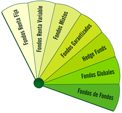

# Tema 2: ¿Cómo elegir un fondo de inversión?

👉 Existe una amplia gama de fondos de inversión, con objetivos y niveles de riesgo distintos. El principal criterio para distinguir unos de otros es la **política  de inversión o vocación inversora**. Esta política o vocación, definida en el folleto, determina el tipo de activos en los  que se va a invertir el patrimonio del fondo, y por lo tanto, el nivel de riesgo que asumen los partícipes.

👉 Riesgo y rentabilidad son dos conceptos estrechamente ligados. A mayor riesgo, suele haber mayor rentabilidad potencial, pero también más posibilidades de sufrir pérdidas importantes.

👉 Según su vocación inversora, pueden distinguirse los siguientes tipos de fondos:

- **Fondos de renta fija**: son aquellos que invierten la mayoría de su patrimonio en activos de renta fija, como bonos, obligaciones, letras y pagarés. Estos fondos, por lo general, implican un  riesgo medio o bajo. No hay que confundir “renta fija” con “rentabilidad fija”. Los fondos de renta fija también pueden dar lugar a pérdidas, principalmente como consecuencia de la evolución de los tipos de interés.

- Los **Fondos de renta variable** invierten la mayor parte de su patrimonio en acciones de empresas. Este grupo de fondos es muy amplio, con niveles de riesgo y rentabilidad muy dispares, por lo que se suelen establecer subcategorías según la situación geográfica de los mercados en que se invierta, el sector de actividad u otras características.

- Los **Fondos mixtos** son aquellos que invierten parte de su patrimonio en renta fija y parte en renta variable.

- Los **Fondos globales** tienen libertad para no fijar de antemano los porcentajes que van a invertir en renta fija o variable, la moneda en que estarán denominados los activos en los que inviertan o la distribución geográfica de la inversión. En esta categoría es posible encontrar fondos con elevados niveles de riesgo.

- Los **Fondos garantizados** aseguran al inversor, a una determinada fecha denominada vencimiento de la garantía, el valor de su inversión inicial más una rentabilidad fija o variable. Estos fondos presentan características peculiares (fecha de vencimiento de la garantía, objetivo de rentabilidad, comisiones, ventanas de liquidez, preavisos, etc.) que deben ser conocidas antes de la suscripción, ya que pueden no resultar adecuados para todos los inversores.

    Si opta por un fondo garantizado, es conveniente que invierta durante el período de comercialización y que reembolse en el plazo previsto después del vencimiento de la garantía. En general, los reembolsos realizados en fechas distintas no están cubiertos por la garantía, por lo que pueden registrar pérdidas. Igualmente, es importante revisar con atención las comunicaciones que le remita la entidad sobre el vencimiento y condiciones de renovación de la garantía.

👉 Cada inversor debe analizar sus necesidades y expectativas, es decir qué objetivos tiene al invertir, cuál es su situación económica y qué nivel de riesgo puede y quiere asumir y, en función de todo ello, buscar el fondo más apropiado. Si no lo tiene claro siempre puede solicitar ayuda a su entidad financiera.

👉 Para determinar el fondo que mejor se ajusta a sus necesidades, es imprescindible **leer el folleto del fondo**, en el cual se encuentra toda la información necesaria para que pueda tomar una decisión razonada. El inversor debe **consultar con su entidad financiera** cualquier duda en relación con las características y riesgos del fondo.

👉 Los recientes cambios normativos han ampliado la oferta de fondos que pueden adquirir los inversores en nuestro país.

- Las **sociedades de inversión mobiliaria**, conocidas como SICAV, se diferencian de los fondos de inversión por su forma jurídica. Son sociedades anónimas cuyos accionistas son los ahorradores que invierten en ellas aportando su dinero. Las acciones de las SICAV se suelen negociar en el denominado Mercado Alternativo Bursátil. Por lo general se consideran un vehículo de inversión de banca privada, es decir están orientadas a grandes patrimonios.

- Los **fondos y sociedades de inversión inmobiliaria** invierten en inmuebles como edificios de viviendas u oficinas, urbanizaciones, residencias, etc. para su explotación en alquiler. Estos productos son más adecuados como inversión a largo plazo, ya que, en general, tienen menor liquidez que los fondos de inversión mobiliaria y además en el corto o medio plazo suelen tener elevadas comisiones de reembolso.

- Los **fondos cotizados, o ETFs** (exchange traded funds) son fondos cuyas participaciones están admitidas a negociación en Bolsa, por lo que combinan las características de un fondo de inversión con las de un valor cotizado. Su política de inversión consiste en replicar algún índice bursátil o de renta fija.

- Los **fondos de inversión libre**, también conocidos como “fondos de inversión alternativa” o **“hedge funds”**, no están sujetos a las restricciones establecidas para la mayoría de los fondos. Pueden seguir la estrategia de inversión que quieran, invertir en cualquier tipo de activos y endeudarse hasta varias veces su patrimonio. Esta libertad  que les permite acceder a nuevas oportunidades de inversión, también puede implicar mayores niveles de riesgo. Por sus características, en principio, no están destinados a inversores particulares, por lo que se exige una inversión mínima de 50.000 euros.

- Los **fondos de fondos de inversión libre**, se conciben como el medio a través del cual el inversor particular puede acceder a la inversión alternativa. No invierten directamente en valores, sino en otros fondos de inversión, principalmente en hedge funds, con lo que, en principio, gozan de un mayor nivel de diversificación y por tanto de un mayor control del riesgo. Aún así, por las características de los activos en los que invierten (hedge funds) el valor de la inversión puede variar de forma significativa a lo largo del tiempo, y el rendimiento no tiene necesariamente que estar ligado a la evolución de los mercados de valores.

- Tanto los fondos de inversión libre como los fondos de fondos de inversión libre son productos en general poco líquidos, y con libertad para fijar comisiones sin los límites máximos aplicados a los fondos tradicionales. Además, tanto en unos como en otros, el inversor debe firmar un documento de consentimiento en el que declara haber sido informado de todos los riesgos inherentes al producto.

- Por último, en España también se comercializan **fondos y sociedades de inversión extranjeras**, que pueden estar sometidas a la normativa de la Unión Europea (armonizados), o no estarlo (no armonizados).