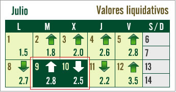
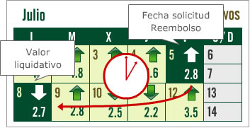
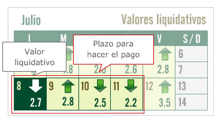

# Suscripciones y reembolsos

Para evitar problemas y, en su caso, afrontarlos mejor, antes de suscribir o reembolsar un fondo, es conveniente que el inversor conozca las peculiaridades de esta operativa y las diferentes alternativas de la que dispone.

- Suscripción de participaciones
- Reembolso de participaciones
- Traspasos (veremos los traspasos en el capítulo siguiente)

## Suscripción de participaciones

La inversión en un fondo se hace mediante la suscripción de participaciones: las gestoras emiten las participaciones necesarias para hacer frente a las solicitudes de suscripción. Cada inversor obtiene un número de participaciones que es el resultado de dividir el importe invertido entre el valor liquidativo aplicable a la operación.

En general, el valor liquidativo aplicable es el del mismo día de la solicitud (que se publicará al día siguiente) o el del día siguiente a la solicitud (publicado dos días después), según se prevea en el folleto del fondo.

Por último conviene recordar que algunos fondos están sujetos a comisiones de suscripción que pueden llegar hasta el 5% del importe invertido.

✍️ **Ejercicio**

La señora Gómez decide invertir 1.000 euros en el Fondo AAA y formaliza la solicitud de suscripción en su entidad financiera el día 3 de octubre. El folleto de este fondo indica que se aplicará el valor liquidativo del día siguiente a la solicitud. Existe una comisión de suscripción del 5%.

**Parte I**

Según lo establecido en el folleto, ¿a qué día corresponderá el valor liquidativo de la suscripción? (Seleccione un día)

→ Día 4 - 10.00 euros por cada participación

> Según lo establecido en el folleto, la operación se realizará al valor liquidativo del día 4 de octubre, que se hará público el día 5.

**Parte II**

¿Cuántas participaciones puede adquirir la Sra. Gómez con sus 1000 euros?

Fórmula a aplicar: Número de participaciones es igual a importe invertido dividido por valor liquidativo

→ 95 participaciones

Si cada participación cuesta 10 euros, la Sra. Gómez podría adquirir 100 participaciones. Pero hay que tener en cuenta que la comisión de suscripción es de un 5% (1000 por 5 divido por 100 es igual a 50 euros). Por lo que se reduce la cantidad disponible a 950 euros con los que la Sra. Gómez puede comprar 95 participaciones, es decir, 950 divido por 10 euros que cuesta cada participación.

## Cuestiones prácticas relacionadas con la suscripción de participaciones

### Entidades comercializadoras

Pueden adquirirse participaciones de fondos de inversión a través de intermediarios financieros como bancos, cajas de ahorros, sociedades de valores, etc. En principio las sociedades gestoras también pueden comercializar sus fondos, bien de forma directa o a través de agentes o apoderados; sin embargo es más frecuente que lo hagan a través de los intermediarios mencionados. A su vez, es fácil encontrar entidades que venden fondos de distintas gestoras, además de los pertenecientes a su grupo financiero.

### Canales de contratación

Se pueden suscribir participaciones de un fondo en las sucursales de las entidades financieras, por teléfono, por Internet e incluso a través de agentes que actúan en nombre y por cuenta de la entidad. Si se utiliza esta última modalidad, nunca se le debe entregar el efectivo al agente ni firmar cheques a su nombre: el importe se hará llegar directamente a la cuenta del fondo de inversión en el depositario.

### Exigencia de cuenta corriente

Es frecuente que las entidades financieras exijan la apertura de  una cuenta corriente (nunca una cuenta de valores, que no es necesaria cuando se trata de fondos de inversión) para canalizar los movimientos derivados de la suscripción y reembolso de participaciones. El objetivo es mejorar la eficacia operativa, pero no se trata de una obligación legal, por lo que en ningún caso estas cuentas corrientes pueden llevar aparejadas comisiones de apertura, mantenimiento o cancelación para el cliente, salvo que también se utilicen para operativa ajena al fondo de inversión

## Reembolso de participaciones

Cuando un inversor quiere recuperar el dinero invertido en un fondo, tiene que reembolsar sus participaciones

Veamos algunas normas que regulan los reembolsos de participaciones de fondos de inversión:

**1.**

El partícipe puede reembolsar todas o parte de sus participaciones. A cambio recibe el importe que resulte de multiplicar el valor liquidativo que corresponda por el número de participaciones reembolsadas. El valor liquidativo aplicable a los reembolsos se determina de la misma manera que para las suscripciones: será el del día de la solicitud o el del día siguiente (según lo que establezca el folleto).

**2.**

Los folletos también suelen recoger lo que se denomina “hora de corte”, a partir de la cual las solicitudes recibidas se consideran realizadas al día hábil siguiente, a efectos de valor liquidativo aplicable.

En este ejemplo, suponiendo que la solicitud se hubiera hecho el día 5 después de la hora de corte, se entendería como realizada al día hábil siguiente, día 8. El valor liquidativo a aplicar sería el del 8 o el del 9 (día de la solicitud o día siguiente, según establezca el folleto). En este caso supondremos se aplica el día 8 (2,7).

**3.**

Con carácter general, el depositario hará efectivo el pago del reembolso al partícipe en un plazo máximo de tres días hábiles, contados desde la fecha del valor liquidativo que resulte aplicable. Excepcionalmente este plazo se podrá ampliar hasta cinco días hábiles.

✍️ **Ejercicio**

Continuando con el ejemplo anterior, al cabo de seis meses, el día 3 de abril a las 13:15 de la mañana, la Sra. Gómez reembolsa sus 95 participaciones. El folleto del fondo fijaba como hora de corte las 12:00 de la mañana.

**Parte I**

¿En qué día se considerará presentada la solicitud de reembolso? (Seleccione un día)

→ Día 4 - 11.00 euros por cada participación

> Puesto que la solicitud de reembolso se ha realizado después de la hora de corte, a efectos de valor liquidativo aplicable la solicitud se considera presentada el día siguiente, el 4 de abril.

**Parte II**

El valor liquidativo aplicable resulta ser de 11 euros. Suponiendo que no hay comisión de reembolso, ¿Cuál sería el importe que le abonarían al reembolsar? (Seleccione un día)

Fórmula a aplicar: Importe de reembolso es igual al Número de participaciones multiplicado por el Valor liquidativo.

→ 1.045 euros  

> En principio, el importe a reembolsar sería de 1.045 euros (95 x 11).

**Parte III**

Sin embargo, el folleto del Fondo AAA establece que si el partícipe reembolsa durante el primer año de permanencia en el fondo se aplicará una comisión de reembolso del 5%.

Por tanto, ¿cuánto será la cantidad que en realidad obtiene la Sra. Gómez? (95 participaciones que vende a 11 euros)

→ 992,75 euros  

>En este caso, se aplica la comisión del 5% (1.045 X 5% = 52.25 euros). Por tanto la cantidad que en realidad obtiene la señora Gómez, antes de aplicar la retención fiscal, es de 992,75 euros (1.045 – 52.25) en lugar de 1.045. ¡Hay que tener cuidado con las comisiones de reembolso!

---

Es importante tener en cuenta los siguientes aspectos prácticos relacionados con el reembolso de participaciones:

- **Inversión mínima a mantener**. En ocasiones los fondos exigen el mantenimiento de una inversión mínima para poder conservar la condición de partícipe. Este dato, que también se encuentra en el folleto, es muy relevante para el inversor porque si en un momento dado deseara efectuar un reembolso o traspaso parcial, y como consecuencia el valor de la inversión o el número de participaciones que se mantienen en el fondo quedaran por debajo del “mínimo a mantener”, la gestora podrá llevar a cabo el reembolso total de sus participaciones. 

- **Preavisos**. Las gestoras podrán exigir preavisos de hasta 10 días para aquellas solicitudes de reembolso superiores a 300.000 euros.

